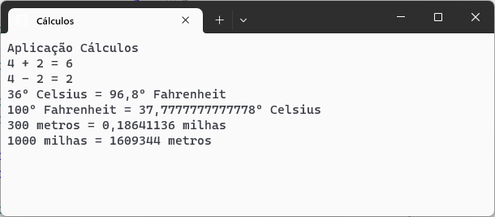

# Calculos :1234:

Aplicação C# para efetuar diferente tipo de cálculos.

Desenvolvida no âmbito da ação de formação **Introdução ao Git e GitHub**

## Operações Suportadas

Neste momento esta aplicação suporta as seguintes operações:
- Somar
- Subtrair
- Converter temperatura
	- Celsius :arrow_right: Fahrenheit
	- Fahrenheit :arrow_right: Celsius
- Conversão de distância
	- metros :arrow_right: milhas
	- milhas :arrow_right: metros

## Tecnologias utilizadas neste projeto

- Visual Studio 2022
- C#
- Git
- GitHub Desktop
- Plataforma GitHub

